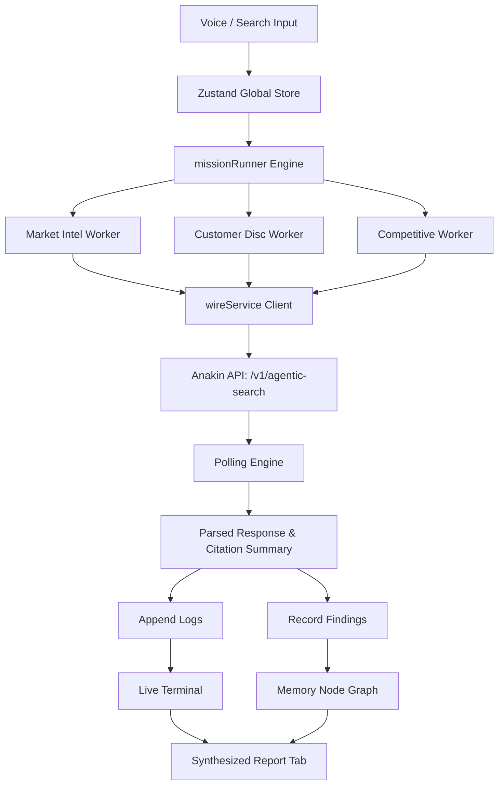
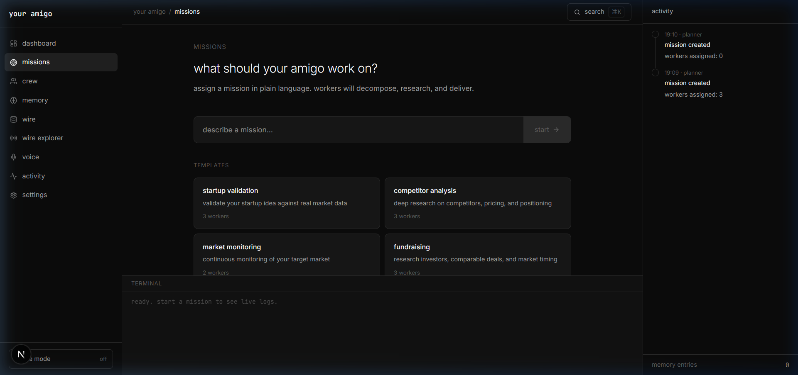
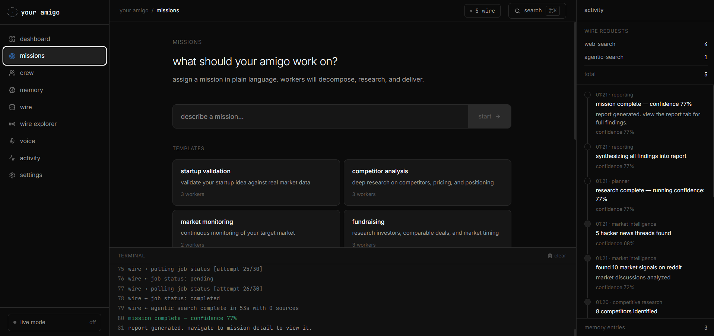
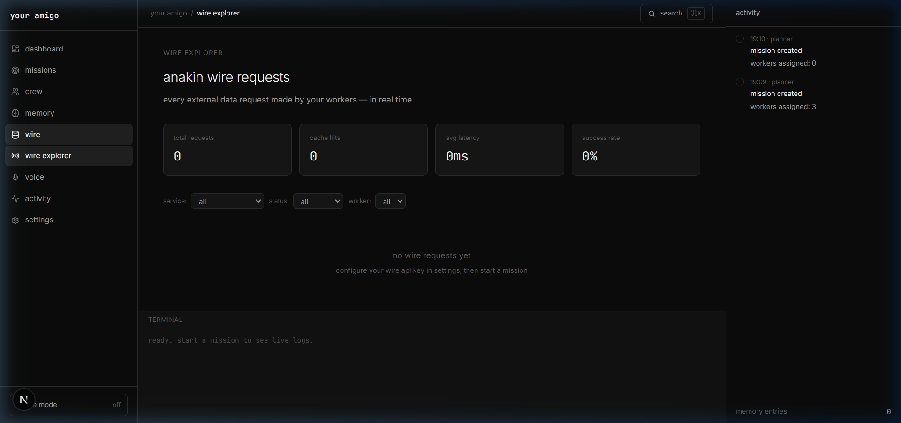
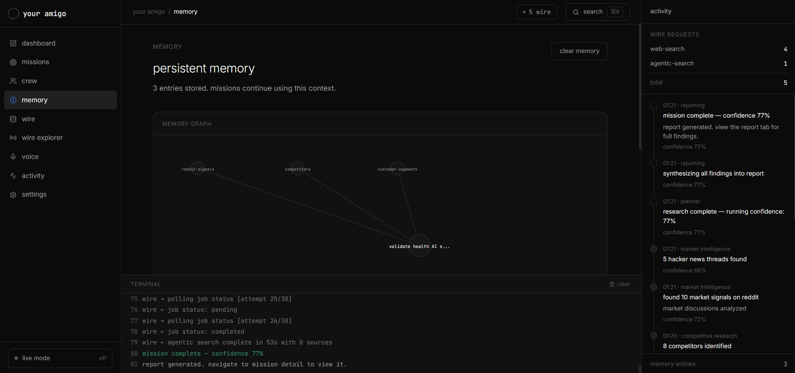
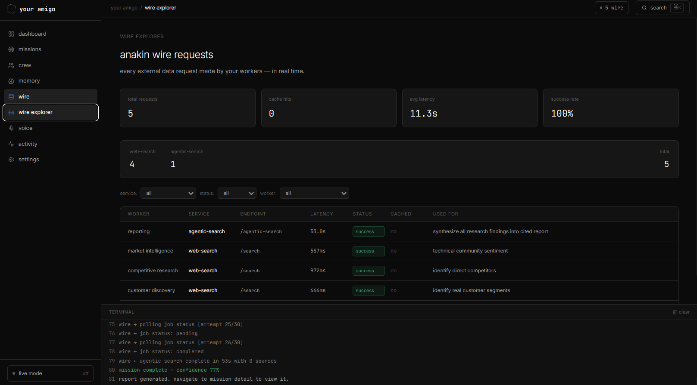
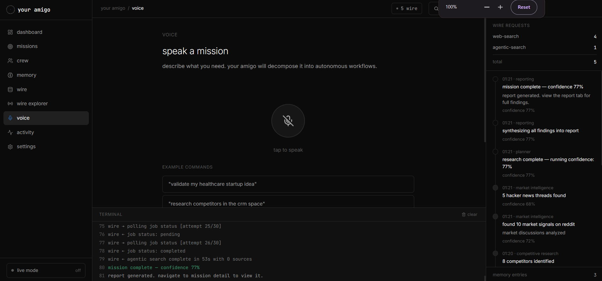

# your amigo

An autonomous, mission-driven intelligence workspace for startup founders. **your amigo** runs continuous background research workflows, queries live web sources via the **Anakin Wire** API layer, updates local semantic knowledge databases, and compiles evidence-backed executive reports.

Inspired by premium, search-engine designs (like Perplexity and Juris Legal AI), **your amigo** features a clean minimal layout, Georgia italic serif typography, interactive accent focus glows, and a dark developer aesthetic.

---

## architecture and data flow



---

## feature suite

1. **minimal search-engine ux** - assign missions in plain natural language or select suggested templates.
2. **editorial typography** - classic Georgia serif italic highlights contrasted with clean developer mono-spacing.
3. **interactive input glow** - input queries feature a dynamic active border glow and neon box-shadow aura on focus.
4. **real-time terminal logs** - see exactly what queries your workers are running in a dedicated developer console.
5. **anakin wire explorer** - trace every outbound request with latencies, cached hits, and detail data-flow diagrams.
6. **obsidian-style memory graph** - visualize connections between different topics in your persistent workspace memory.
7. **mission timeline replay** - scrub backwards and forwards to replay exactly what actions were taken by your crew.
8. **dedicated voice interface** - speak a mission directly using the Web Speech API with live visualizers.
9. **structured reporting** - Dynamic market summaries, competitor listings, pricing, and execution risk sections.
10. **raycast command palette** - navigate instantly using `Cmd+K` / `Ctrl+K`.

---

## the crew (autonomous agents)

- **market intelligence** - searches Reddit and Hacker News for community pain points and signals.
- **customer discovery** - maps demographic target groups and high-intent customer segments.
- **competitive research** - benchmarks direct/indirect alternatives.
- **pricing intelligence** - extracts pricing data from competitor product grids.
- **growth** - audits acquisition channels and marketing distribution lines.
- **technical research** - deep-dives into tech stacks, API documentation, and libraries.
- **reporting** - gathers the crew's logs and compiles the final executive report.

---

## technical specifications

### 1. technology stack
* **framework:** Next.js 15 (App Router, Turbopack) & React 19
* **language:** TypeScript
* **state management:** Zustand + localStorage selective persistence (whitelisting `wireRequests` and `terminalLogs` to survive reloads)
* **styling:** Custom CSS variables styling system (`globals.css`) & Tailwind CSS utilities
* **visualization:** React Flow (for the node-based interactive memory graph)
* **icons:** Lucide React

### 2. anakin api client specifications
The search client integrates with Anakin's API endpoints under `src/services/wire.ts`:
* **standard search:** Hits `POST https://api.anakin.io/v1/search` with the query payload.
* **agentic search (asynchronous):**
  1. Issues a `POST https://api.anakin.io/v1/agentic-search` request sending `prompt`.
  2. Receives a queued `job_id`.
  3. Initiates a polling loop (hitting `GET https://api.anakin.io/v1/agentic-search/{id}` every 2 seconds for up to 30 attempts).
  4. Returns the final generated JSON report and references once complete.

### 3. classification and parsing engine
Inside `src/services/missionRunner.ts`, we implement a RegEx sentence splitter and classifier. Scraped lines are distributed into matching report slots based on keywords:
* **market:** searches `market, size, volume, trend, target, segment, demand`
* **customers:** searches `customer, segment, manager, owner, user, demographic`
* **competition:** searches `competitor, alternative, rival, direct, landscape`
* **pricing:** searches `price, pricing, cost, subscription, tier, plan`
* **risks:** searches `risk, liability, concern, legal, compliance, regulation`

---

## quick start

### 1. install dependencies
Ensure you use the legacy peer dependencies flag due to React 19 lockfile configs:
```bash
npm install --legacy-peer-deps
```

### 2. run the development server
```bash
npm run dev
```
Open [http://localhost:3000](http://localhost:3000) in your browser.

### 3. configure your api key
1. Navigate to the **wire** tab in the sidebar (or hit `Ctrl+K` and type `wire settings`).
2. Paste your Anakin API Key from [anakin.io](https://anakin.io) and click **"save key"**.
3. Click **"test connection"** to verify that your key successfully authenticates with the Anakin API.

---

## screenshots


















